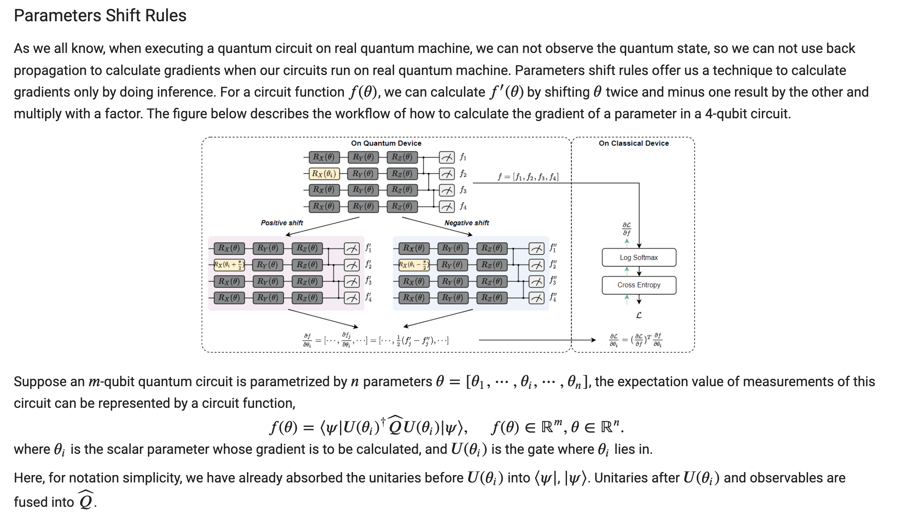
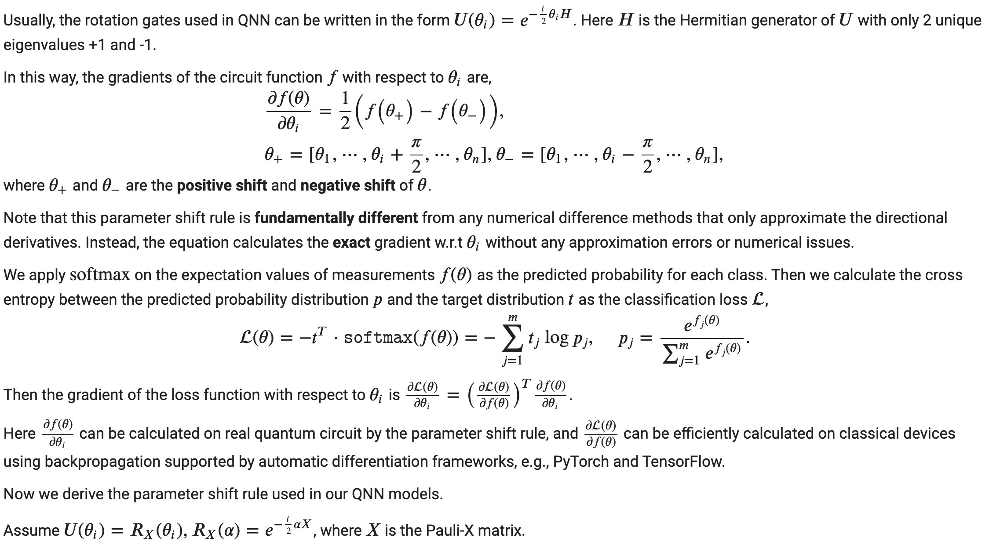
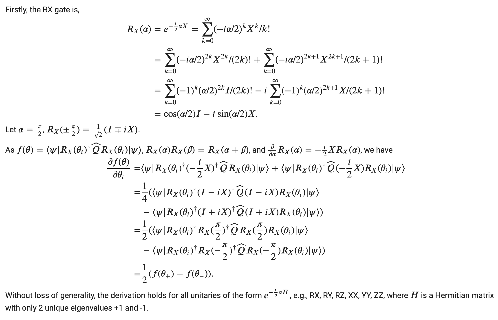

## On-chip Training of Quantum Neural Networks with parameter shift

Authors: Zirui Li, Hanrui Wang

Use Colab to run this example: 

[comment]: <> (#%% md)

### Outline
1. Introduction to Parameters Shift Rules.
2. Build the model and define the function.
3. Train the model.

[comment]: <> (#%% md)

## Introduction to Parameters Shift Rules

In this tutorial, you can learn parameters shift rules and how to use parameters shift rules to calculate gradients and use the gradient to train the model.

### Back Propagation

Previously, our quantum model was based on qiskit and pytorch. Once we did an inference of the model, pytorch will automatically build a computaion graph. We can calculate the gradients of each node in the computational graph in a reversed order based on the chain rule. This is called back propagation.

### Parameters Shift Rules

